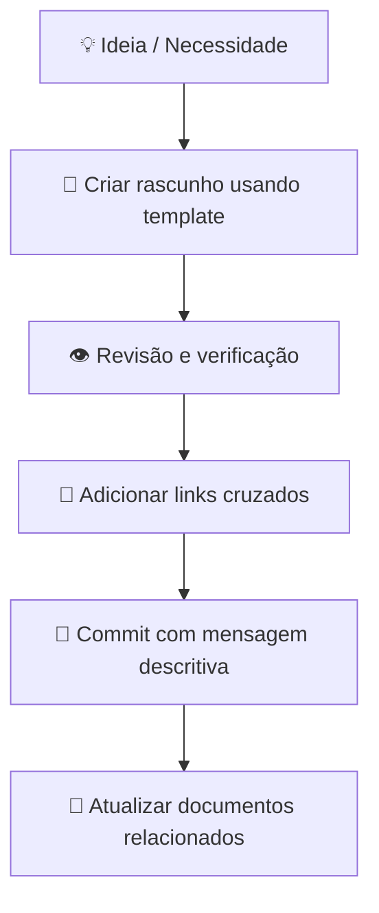

# Guia de Contribuição

Este documento descreve como criar, editar e organizar documentos neste repositório.

---

## Princípios

1. **Nada existe apenas na memória** — todo conhecimento deve ser registrado
2. **Rastreabilidade total** — toda decisão deve ter histórico
3. **Modularidade** — componentes são reutilizados entre produtos
4. **Padronização** — use sempre os templates disponíveis

---

## Front Matter Obrigatório

Todo documento Markdown deve começar com front matter YAML:

```yaml
---
title: Título do Documento
id: PREFIXO-XXXX
status: draft | active | obsolete | archived
revision: "1.0"
owner: nome-responsavel
created: "YYYY-MM-DD"
updated: "YYYY-MM-DD"
related:
  - /caminho/para/documento-relacionado.md
tags: [tag1, tag2]
---
```

---

## Prefixos de Identificadores

| Prefixo | Uso | Exemplo |
|---------|-----|---------|
| `REQ` | Requisito | REQ-0001 |
| `ADR` | Architecture Decision Record | ADR-0001 |
| `COMP` | Componente | COMP-0001 |
| `TEST` | Plano de Teste | TEST-0001 |
| `SIM` | Simulação | SIM-0001 |
| `BOM` | Bill of Materials | BOM-0001 |
| `DRW` | Desenho Técnico | DRW-0001 |
| `SUP` | Fornecedor | SUP-0001 |
| `MFG` | Processo de Fabricação | MFG-0001 |

---

## Fluxo de Trabalho



---

## Mensagens de Commit

Use o formato:

```
tipo(escopo): descrição breve

[corpo opcional]

[rodapé opcional]
```

**Tipos:** `feat`, `fix`, `docs`, `chore`, `refactor`, `test`, `eng`

**Exemplos:**
```
docs(requirements): adiciona REQ-0001 ao sistema de requisitos
feat(products/utv): adiciona arquitetura do sistema de freios
eng(cad): atualiza padrão de nomenclatura CAD
```

---

## Convenção de Nomenclatura de Arquivos

| Tipo | Convenção | Exemplo |
|------|-----------|---------|
| Documento | `lowercase-com-hifens.md` | `architecture.md` |
| Requisito | `REQ-XXXX.md` | `REQ-0001.md` |
| ADR | `ADR-XXXX-titulo.md` | `ADR-0001-escolha-chassis.md` |
| Desenho | `DRW-XXXX-descricao.pdf` | `DRW-0001-chassis-main.pdf` |
| CAD | `SISTEMA-SUBSIST-COMP-vXX.step` | `CHASSIS-MAIN-FRAME-v01.step` |

---

## Estrutura de Links Cruzados

Todo documento deve referenciar documentos relacionados:

```
Requisito → Arquitetura → CAD → BOM → Teste → Validação → Produção
```

Exemplo em um requisito:

```markdown
## Links Relacionados
- **Arquitetura:** [/architecture/utv/chassis.md](../../architecture/utv/chassis.md)
- **Projeto CAD:** [/products/utv/chassis/cad/](../../products/utv/chassis/cad/)
- **BOM:** [/bom/utv/chassis.md](../../bom/utv/chassis.md)
- **Testes:** [/tests/plans/TEST-0001.md](../../tests/plans/TEST-0001.md)
```

---

## Templates Disponíveis

Consulte [/templates](./templates/README.md) para todos os templates disponíveis.

---

## Diretórios e Responsabilidades

| Diretório | Responsável | Frequência de Atualização |
|-----------|-------------|---------------------------|
| `/journal` | Fundador | Diária |
| `/decisions` | Fundador | Por decisão |
| `/requirements` | Engenharia | Por ciclo |
| `/products` | Engenharia | Por milestone |
| `/tests` | Engenharia | Por teste |
