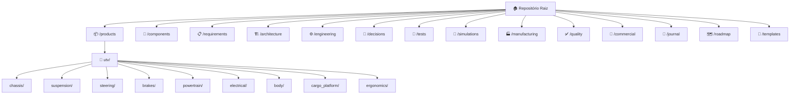
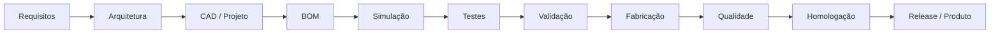

# UTV Startup — Sistema de Engenharia

> **"A engenharia é o principal ativo. O conhecimento vale mais que as máquinas."**

Bem-vindo ao repositório central da nossa startup de engenharia automotiva brasileira.  
Este repositório funciona como um **PLM (Product Lifecycle Management) simplificado**, concentrando toda a estratégia, engenharia, produto, documentação e rastreabilidade da empresa.

---

## Sobre a Empresa

Startup brasileira de engenharia automotiva focada no desenvolvimento de produtos utilitários modulares de alta qualidade.

- **Produto inicial:** UTV Utilitário Modular
- **Filosofia:** Todo produto nasce digital antes de existir fisicamente
- **Diferencial:** Rastreabilidade total, modularidade e rigor de engenharia

---

## Estrutura do Repositório

---

## Índice Rápido

| Área | Descrição | Link |
|------|-----------|------|
| 🚗 Produtos | Todos os produtos e sistemas | [/products](./products/README.md) |
| 🔩 Componentes | Biblioteca de componentes reutilizáveis | [/components](./products/utv/components/README.md) |
| 📋 Requisitos | Sistema de requisitos (REQ-XXXX) | [/requirements](./requirements/README.md) |
| 🏗️ Arquitetura | Arquitetura do sistema e produto | [/architecture](./architecture/README.md) |
| ⚙️ Engenharia | Padrões, normas e processos | [/engineering](./engineering/README.md) |
| 🧠 Decisões | Architecture Decision Records (ADR) | [/decisions](./products/utv/decisions/README.md) |
| 🧪 Testes | Planos e resultados de testes | [/tests](./tests/README.md) |
| 📐 Simulações | FEA, CG, fadiga e resultados | [/simulations](./products/utv/simulations/README.md) |
| 🏭 Fabricação | Processos e controle de produção | [/manufacturing](./manufacturing/README.md) |
| ✅ Qualidade | Procedimentos e métricas de qualidade | [/quality](./quality/README.md) |
| 🏷️ Homologação | Requisitos DENATRAN/INMETRO | [/homologation](./homologation/README.md) |
| 🤝 Fornecedores | Base de fornecedores qualificados | [/suppliers](./suppliers/README.md) |
| 💼 Comercial | Catálogos, manuais e marketing | [/commercial](./commercial/README.md) |
| 🔧 Serviço | Manuais de serviço e garantia | [/service](./service/README.md) |
| 🗺️ Roadmap | Roadmap de produto e empresa | [/roadmap](./roadmap/README.md) |
| 📄 Templates | Templates padronizados | [/templates](./templates/README.md) |
| 📓 Journal | Registro diário de atividades | [/journal](./journal/README.md) |
| 📅 Reuniões | Atas e registros de reuniões | [/meetings](./meetings/README.md) |

---

## Filosofia de Desenvolvimento

Todo produto nasce digital. Antes de qualquer peça ser fabricada, deve existir:

1. ✅ Requisitos documentados
2. ✅ Arquitetura definida
3. ✅ Projeto CAD
4. ✅ BOM (Bill of Materials)
5. ✅ Desenhos técnicos
6. ✅ Simulações realizadas
7. ✅ Plano de testes aprovado

---

## Como Contribuir

Consulte [CONTRIBUTING.md](./CONTRIBUTING.md) para entender como trabalhar neste repositório.

---

## Roadmap

Consulte [ROADMAP.md](./ROADMAP.md) para o planejamento estratégico.

---

## Histórico de Mudanças

Consulte [CHANGELOG.md](./CHANGELOG.md) para o histórico de versões.
