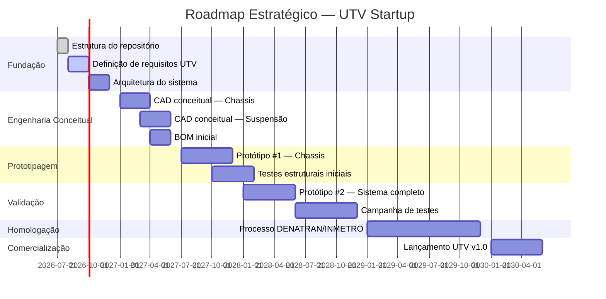
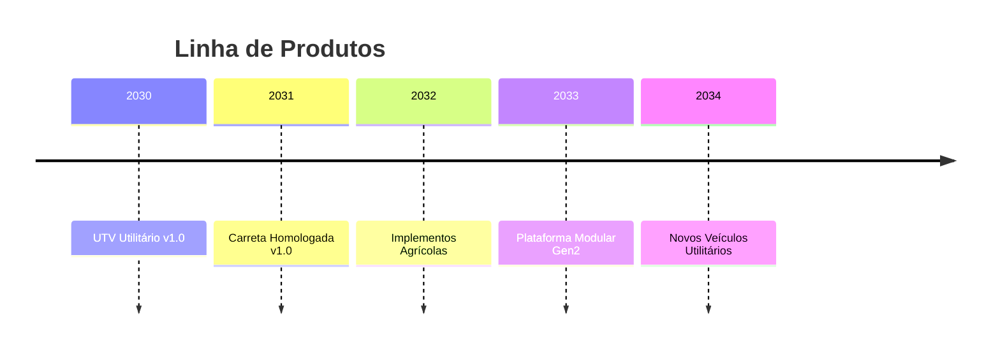

# Roadmap Estratégico

Este documento apresenta o roadmap de alto nível da empresa e dos produtos.  
Para detalhes, consulte o diretório [/roadmap](./roadmap/README.md).

---

## Visão Geral

---

## Fases do Produto UTV

### Fase 0 — Fundação (2026)
- [x] Criar repositório PLM
- [x] Definir filosofia de engenharia
- [ ] Documentar missão e visão
- [ ] Iniciar sistema de requisitos

### Fase 1 — Conceitual (2026–2027)
- [ ] REQ: levantar todos os requisitos do UTV
- [ ] ARQ: definir arquitetura do sistema
- [ ] CAD: modelos conceituais dos sistemas principais
- [ ] BOM: lista preliminar de componentes

### Fase 2 — Detalhamento (2027–2028)
- [ ] CAD: projeto detalhado de todos os sistemas
- [ ] SIM: simulações estruturais e dinâmicas
- [ ] BOM: BOM definitiva com fornecedores
- [ ] DES: desenhos técnicos completos

### Fase 3 — Prototipagem (2027–2028)
- [ ] Fabricação do protótipo #1
- [ ] Testes funcionais
- [ ] Iterações e correções
- [ ] Protótipo #2 validado

### Fase 4 — Homologação (2029)
- [ ] Documentação para DENATRAN
- [ ] Ensaios INMETRO
- [ ] Homologação completa

### Fase 5 — Comercialização (2030+)
- [ ] Lançamento comercial
- [ ] Estrutura de pós-venda
- [ ] Expansão da linha de produtos

---

## Produtos Futuros

---

## Links Relacionados

- [Roadmap de Produto](./roadmap/product/README.md)
- [Roadmap da Empresa](./roadmap/company/README.md)
- [Roadmap Tecnológico](./roadmap/technology/README.md)
- [Roadmap de Industrialização](./roadmap/industrialization/README.md)
- [Decisões Estratégicas](./products/utv/decisions/README.md)
