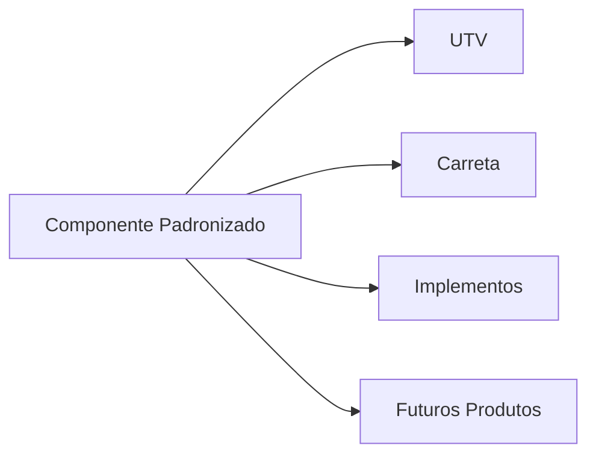

# Biblioteca de Componentes Reutilizáveis

Componentes padronizados utilizados nos produtos da empresa.  
Priorizamos componentes consolidados no mercado nacional.

---

## Filosofia

- **Sempre prefira componentes nacionais consolidados**
- **Documente o fornecedor, código e especificação**
- **Avalie alternativas antes de definir um componente**

---

## Categorias

| Categoria | Descrição | Link |
|-----------|-----------|------|
| Rolamentos | Rolamentos e mancais | [bearings/](./bearings/README.md) |
| Fixadores | Parafusos, porcas e arruelas | [fasteners/](./fasteners/README.md) |
| Motores | Motores elétricos e de combustão | [motors/](./motors/README.md) |
| Caixas de Câmbio | Transmissões e redutores | [gearboxes/](./gearboxes/README.md) |
| Suspensão | Componentes de suspensão | [suspension/](./suspension/README.md) |
| Direção | Componentes de direção | [steering/](./steering/README.md) |
| Elétrica | Componentes elétricos e eletrônicos | [electrical/](./electrical/README.md) |
| Hidráulica | Componentes hidráulicos | [hydraulic/](./hydraulic/README.md) |
| Rodas | Rodas e aros | [wheels/](./wheels/README.md) |
| Pneus | Pneus e câmaras | [tires/](./tires/README.md) |
| Freios | Componentes de freio | [brakes/](./brakes/README.md) |

---

## Template de Componente

Cada componente deve ter documentação seguindo o [template de componente](../templates/component.md).

## Links Relacionados

- [Fornecedores](../suppliers/README.md)
- [BOM](../bom/README.md)
- [Produtos](../products/README.md)
