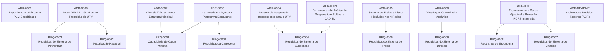

# Architecture Decision Graph

> ⚠️ **Arquivo gerado automaticamente.** Não edite manualmente.

```mermaid
flowchart TD
    ADR_0001["ADR-0001<br/>Repositório GitHub como PLM Simplificado"]
    ADR_0002["ADR-0002<br/>Chassis Tubular como Estrutura Principal"]
    ADR_0003["ADR-0003<br/>Motor VW AP 1.6/1.8 como Propulsão do UTV"]
    ADR_0004["ADR-0004<br/>Sistema de Suspensão Independente para o UTV"]
    ADR_0005["ADR-0005<br/>Sistema de Freios a Disco Hidráulico nos 4 Rodas"]
    ADR_0006["ADR-0006<br/>Direção por Cremalheira Mecânica"]
    ADR_0007["ADR-0007<br/>Ergonomia com Banco Ajustável e Proteção ROPS Integrada"]
    ADR_0008["ADR-0008<br/>Carroceria em Aço com Plataforma Basculante"]
    ADR_0009["ADR-0009<br/>Ferramentas de Análise de Suspensão e Software CAD 3D"]
    ADR_README["ADR-README<br/>Architecture Decision Records (ADR)"]
    REQ_0001["REQ-0001<br/>Capacidade de Carga Mínima"]
    ADR_0002 --> REQ_0001
    REQ_0002["REQ-0002<br/>Motorização Nacional"]
    ADR_0003 --> REQ_0002
    REQ_0003["REQ-0003<br/>Requisitos do Sistema de Powertrain"]
    ADR_0003 --> REQ_0003
    REQ_0004["REQ-0004<br/>Requisitos do Sistema de Suspensão"]
    ADR_0004 --> REQ_0004
    REQ_0005["REQ-0005<br/>Requisitos do Sistema de Freios"]
    ADR_0005 --> REQ_0005
    REQ_0006["REQ-0006<br/>Requisitos do Sistema de Direção"]
    ADR_0006 --> REQ_0006
    REQ_0007["REQ-0007<br/>Requisitos do Sistema de Chassis"]
    ADR_0007 --> REQ_0007
    REQ_0008["REQ-0008<br/>Requisitos de Ergonomia"]
    ADR_0007 --> REQ_0008
    REQ_0001["REQ-0001<br/>Capacidade de Carga Mínima"]
    ADR_0008 --> REQ_0001
    REQ_0009["REQ-0009<br/>Requisitos da Carroceria"]
    ADR_0008 --> REQ_0009
    REQ_0004["REQ-0004<br/>Requisitos do Sistema de Suspensão"]
    ADR_0009 --> REQ_0004
```
