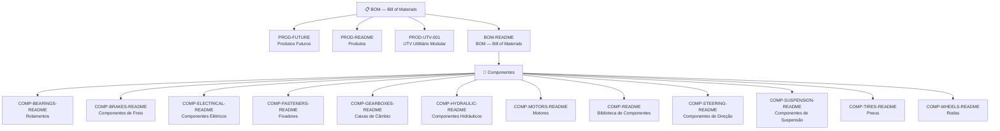

# BOM Tree

> ⚠️ **Arquivo gerado automaticamente.** Não edite manualmente.

```mermaid
graph TD
    BOM_ROOT["📋 BOM — Bill of Materials"]
    BOM_ROOT --> PROD_FUTURE["PROD-FUTURE<br/>Produtos Futuros"]
    BOM_ROOT --> PROD_README["PROD-README<br/>Produtos"]
    BOM_ROOT --> PROD_UTV_001["PROD-UTV-001<br/>UTV Utilitário Modular"]
    BOM_ROOT --> BOM_README["BOM-README<br/>BOM — Bill of Materials"]
    COMP_GROUP["🔩 Componentes"] --> COMP_BEARINGS_README["COMP-BEARINGS-README<br/>Rolamentos"]
    COMP_GROUP["🔩 Componentes"] --> COMP_BRAKES_README["COMP-BRAKES-README<br/>Componentes de Freio"]
    COMP_GROUP["🔩 Componentes"] --> COMP_ELECTRICAL_README["COMP-ELECTRICAL-README<br/>Componentes Elétricos"]
    COMP_GROUP["🔩 Componentes"] --> COMP_FASTENERS_README["COMP-FASTENERS-README<br/>Fixadores"]
    COMP_GROUP["🔩 Componentes"] --> COMP_GEARBOXES_README["COMP-GEARBOXES-README<br/>Caixas de Câmbio"]
    COMP_GROUP["🔩 Componentes"] --> COMP_HYDRAULIC_README["COMP-HYDRAULIC-README<br/>Componentes Hidráulicos"]
    COMP_GROUP["🔩 Componentes"] --> COMP_MOTORS_README["COMP-MOTORS-README<br/>Motores"]
    COMP_GROUP["🔩 Componentes"] --> COMP_README["COMP-README<br/>Biblioteca de Componentes"]
    COMP_GROUP["🔩 Componentes"] --> COMP_STEERING_README["COMP-STEERING-README<br/>Componentes de Direção"]
    COMP_GROUP["🔩 Componentes"] --> COMP_SUSPENSION_README["COMP-SUSPENSION-README<br/>Componentes de Suspensão"]
    COMP_GROUP["🔩 Componentes"] --> COMP_TIRES_README["COMP-TIRES-README<br/>Pneus"]
    COMP_GROUP["🔩 Componentes"] --> COMP_WHEELS_README["COMP-WHEELS-README<br/>Rodas"]
    BOM_README --> COMP_GROUP["🔩 Componentes"]
```
