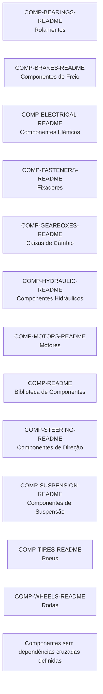

# Component Dependency Graph

> ⚠️ **Arquivo gerado automaticamente.** Não edite manualmente.

```mermaid
graph LR
    COMP_BEARINGS_README["COMP-BEARINGS-README<br/>Rolamentos"]
    COMP_BRAKES_README["COMP-BRAKES-README<br/>Componentes de Freio"]
    COMP_ELECTRICAL_README["COMP-ELECTRICAL-README<br/>Componentes Elétricos"]
    COMP_FASTENERS_README["COMP-FASTENERS-README<br/>Fixadores"]
    COMP_GEARBOXES_README["COMP-GEARBOXES-README<br/>Caixas de Câmbio"]
    COMP_HYDRAULIC_README["COMP-HYDRAULIC-README<br/>Componentes Hidráulicos"]
    COMP_MOTORS_README["COMP-MOTORS-README<br/>Motores"]
    COMP_README["COMP-README<br/>Biblioteca de Componentes"]
    COMP_STEERING_README["COMP-STEERING-README<br/>Componentes de Direção"]
    COMP_SUSPENSION_README["COMP-SUSPENSION-README<br/>Componentes de Suspensão"]
    COMP_TIRES_README["COMP-TIRES-README<br/>Pneus"]
    COMP_WHEELS_README["COMP-WHEELS-README<br/>Rodas"]
    COMP_NOTE["Componentes sem dependências cruzadas definidas"]
```
