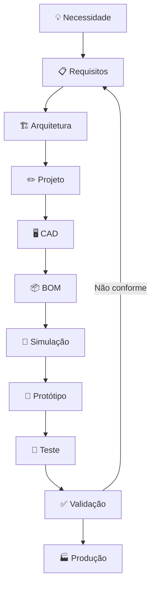

# Engineering Workflow

> ⚠️ **Arquivo gerado automaticamente.** Não edite manualmente.

## 📋 Requisitos

| ID | Título | Status |
|----|--------|--------|
| REQ-0001 | Capacidade de Carga Mínima | draft |
| REQ-0002 | Motorização Nacional | draft |
| REQ-0003 | Requisitos do Sistema de Powertrain | draft |
| REQ-0004 | Requisitos do Sistema de Suspensão | draft |
| REQ-0005 | Requisitos do Sistema de Freios | draft |
| REQ-0006 | Requisitos do Sistema de Direção | draft |
| REQ-0007 | Requisitos do Sistema de Chassis | draft |
| REQ-0008 | Requisitos de Ergonomia | draft |
| REQ-0009 | Requisitos da Carroceria | draft |
| REQ-README | Sistema de Requisitos | active |

## 🖥️ Simulações

| ID | Título | Status |
|----|--------|--------|
| SIM-CG-README | Centro de Gravidade | active |
| SIM-FATIGUE-README | Fadiga | active |
| SIM-FEA-README | FEA — Análise de Elementos Finitos | active |
| SIM-README | Simulações | active |
| SIM-RESULTS-README | Resultados | active |
| SIM-STIFFNESS-README | Rigidez | active |
| SIM-WEIGHT-README | Análise de Peso | active |

## 🧪 Testes

| ID | Título | Status |
|----|--------|--------|
| TEST-LESSONS_LEARNED-README | Lições Aprendidas | active |
| TEST-MEDIA-README | Fotos e Vídeos | active |
| TEST-PLANS-README | Planos de Teste | active |
| TEST-README | Testes | active |
| TEST-REPORTS-README | Relatórios de Testes | active |
| TEST-RESULTS-README | Resultados de Testes | active |

## ✅ Validações

| ID | Título | Status |
|----|--------|--------|
| VAL-PLANS-README | Planos de Validação | active |
| VAL-REPORTS-README | Relatórios de Validação | active |
| VAL-RESULTS-README | Resultados de Validação | active |

## 🏭 Fabricação

| ID | Título | Status |
|----|--------|--------|
| MFG-DIMENSIONAL-README | Controle Dimensional | active |
| MFG-FIXTURES-README | Gabaritos | active |
| MFG-FLOW-README | Fluxo de Fabricação | active |
| MFG-INSPECTION-README | Inspeção | active |
| MFG-QUALITY-README | Qualidade na Produção | active |
| MFG-TOOLS-README | Ferramentas | active |
| MFG-WELDING-README | Soldagem | active |
