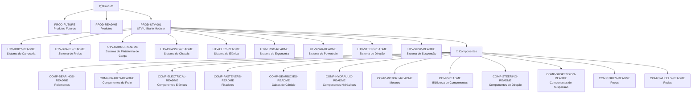

# Product Breakdown Structure (PBS)

> ⚠️ **Arquivo gerado automaticamente.** Não edite manualmente.

```mermaid
graph TD
    PROD_ROOT["📦 Produto"]
    PROD_ROOT --> PROD_FUTURE["PROD-FUTURE<br/>Produtos Futuros"]
    PROD_ROOT --> PROD_README["PROD-README<br/>Produtos"]
    PROD_ROOT --> PROD_UTV_001["PROD-UTV-001<br/>UTV Utilitário Modular"]
    PROD_UTV_001 --> UTV_BODY_README["UTV-BODY-README<br/>Sistema de Carroceria"]
    PROD_UTV_001 --> UTV_BRAKE_README["UTV-BRAKE-README<br/>Sistema de Freios"]
    PROD_UTV_001 --> UTV_CARGO_README["UTV-CARGO-README<br/>Sistema de Plataforma de Carga"]
    PROD_UTV_001 --> UTV_CHASSIS_README["UTV-CHASSIS-README<br/>Sistema de Chassis"]
    PROD_UTV_001 --> UTV_ELEC_README["UTV-ELEC-README<br/>Sistema de Elétrica"]
    PROD_UTV_001 --> UTV_ERGO_README["UTV-ERGO-README<br/>Sistema de Ergonomia"]
    PROD_UTV_001 --> UTV_PWR_README["UTV-PWR-README<br/>Sistema de Powertrain"]
    PROD_UTV_001 --> UTV_STEER_README["UTV-STEER-README<br/>Sistema de Direção"]
    PROD_UTV_001 --> UTV_SUSP_README["UTV-SUSP-README<br/>Sistema de Suspensão"]
    COMP_LIB["🔩 Componentes"] --> COMP_BEARINGS_README["COMP-BEARINGS-README<br/>Rolamentos"]
    COMP_LIB["🔩 Componentes"] --> COMP_BRAKES_README["COMP-BRAKES-README<br/>Componentes de Freio"]
    COMP_LIB["🔩 Componentes"] --> COMP_ELECTRICAL_README["COMP-ELECTRICAL-README<br/>Componentes Elétricos"]
    COMP_LIB["🔩 Componentes"] --> COMP_FASTENERS_README["COMP-FASTENERS-README<br/>Fixadores"]
    COMP_LIB["🔩 Componentes"] --> COMP_GEARBOXES_README["COMP-GEARBOXES-README<br/>Caixas de Câmbio"]
    COMP_LIB["🔩 Componentes"] --> COMP_HYDRAULIC_README["COMP-HYDRAULIC-README<br/>Componentes Hidráulicos"]
    COMP_LIB["🔩 Componentes"] --> COMP_MOTORS_README["COMP-MOTORS-README<br/>Motores"]
    COMP_LIB["🔩 Componentes"] --> COMP_README["COMP-README<br/>Biblioteca de Componentes"]
    COMP_LIB["🔩 Componentes"] --> COMP_STEERING_README["COMP-STEERING-README<br/>Componentes de Direção"]
    COMP_LIB["🔩 Componentes"] --> COMP_SUSPENSION_README["COMP-SUSPENSION-README<br/>Componentes de Suspensão"]
    COMP_LIB["🔩 Componentes"] --> COMP_TIRES_README["COMP-TIRES-README<br/>Pneus"]
    COMP_LIB["🔩 Componentes"] --> COMP_WHEELS_README["COMP-WHEELS-README<br/>Rodas"]
    PROD_UTV_001 --> COMP_LIB["🔩 Componentes"]
```
