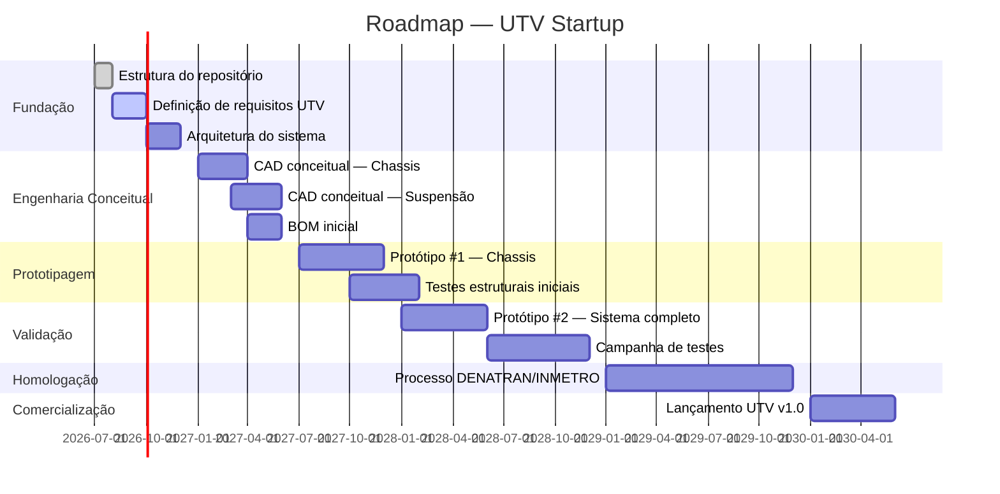

# Project Roadmap

> ⚠️ **Arquivo gerado automaticamente.** Não edite manualmente.

## Requisitos Ativos

| ID | Título | Status | Revisão |
|----|--------|--------|---------|
| REQ-0001 | Capacidade de Carga Mínima | draft | 1.0 |
| REQ-0002 | Motorização Nacional | draft | 1.0 |
| REQ-0003 | Requisitos do Sistema de Powertrain | draft | 1.0 |
| REQ-0004 | Requisitos do Sistema de Suspensão | draft | 1.1 |
| REQ-0005 | Requisitos do Sistema de Freios | draft | 2.0 |
| REQ-0006 | Requisitos do Sistema de Direção | draft | 1.0 |
| REQ-0007 | Requisitos do Sistema de Chassis | draft | 1.1 |
| REQ-0008 | Requisitos de Ergonomia | draft | 1.0 |
| REQ-0009 | Requisitos da Carroceria | draft | 1.0 |
| REQ-README | Sistema de Requisitos | active | 1.0 |
