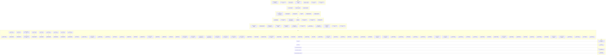

# Requirements Traceability Graph

> ⚠️ **Arquivo gerado automaticamente.** Não edite manualmente.

```mermaid
flowchart LR
    subgraph SG_REQUIREMENT["📋 REQ"]
        REQ_0001["REQ-0001<br/>Capacidade de Carga Mínima"]
        REQ_0002["REQ-0002<br/>Motorização Nacional"]
        REQ_0003["REQ-0003<br/>Homologação DENATRAN"]
        REQ_README["REQ-README<br/>Sistema de Requisitos"]
    end
    subgraph SG_UTV_SYSTEM["🏗️ SYS"]
        UTV_BODY_ARCH["UTV-BODY-ARCH<br/>Arquitetura — Carroceria"]
        UTV_BODY_BOM["UTV-BODY-BOM<br/>BOM — Carroceria"]
        UTV_BODY_COMP["UTV-BODY-COMP<br/>Componentes — Carroceria"]
        UTV_BODY_DRW["UTV-BODY-DRW<br/>Desenhos Técnicos — Carroceria"]
        UTV_BODY_HIST["UTV-BODY-HIST<br/>Histórico — Carroceria"]
        UTV_BODY_README["UTV-BODY-README<br/>Sistema de Carroceria"]
        UTV_BODY_REQ["UTV-BODY-REQ<br/>Requisitos — Carroceria"]
        UTV_BODY_SIM["UTV-BODY-SIM<br/>Simulações — Carroceria"]
        UTV_BODY_TEST["UTV-BODY-TEST<br/>Testes — Carroceria"]
        UTV_BODY_VAL["UTV-BODY-VAL<br/>Validação — Carroceria"]
        UTV_BRAKE_ARCH["UTV-BRAKE-ARCH<br/>Arquitetura — Freios"]
        UTV_BRAKE_BOM["UTV-BRAKE-BOM<br/>BOM — Freios"]
        UTV_BRAKE_COMP["UTV-BRAKE-COMP<br/>Componentes — Freios"]
        UTV_BRAKE_DRW["UTV-BRAKE-DRW<br/>Desenhos Técnicos — Freios"]
        UTV_BRAKE_HIST["UTV-BRAKE-HIST<br/>Histórico — Freios"]
        UTV_BRAKE_README["UTV-BRAKE-README<br/>Sistema de Freios"]
        UTV_BRAKE_REQ["UTV-BRAKE-REQ<br/>Requisitos — Freios"]
        UTV_BRAKE_SIM["UTV-BRAKE-SIM<br/>Simulações — Freios"]
        UTV_BRAKE_TEST["UTV-BRAKE-TEST<br/>Testes — Freios"]
        UTV_BRAKE_VAL["UTV-BRAKE-VAL<br/>Validação — Freios"]
        UTV_CARGO_ARCH["UTV-CARGO-ARCH<br/>Arquitetura — Plataforma de Carga"]
        UTV_CARGO_BOM["UTV-CARGO-BOM<br/>BOM — Plataforma de Carga"]
        UTV_CARGO_COMP["UTV-CARGO-COMP<br/>Componentes — Plataforma de Carga"]
        UTV_CARGO_DRW["UTV-CARGO-DRW<br/>Desenhos Técnicos — Plataforma de Carga"]
        UTV_CARGO_HIST["UTV-CARGO-HIST<br/>Histórico — Plataforma de Carga"]
        UTV_CARGO_README["UTV-CARGO-README<br/>Sistema de Plataforma de Carga"]
        UTV_CARGO_REQ["UTV-CARGO-REQ<br/>Requisitos — Plataforma de Carga"]
        UTV_CARGO_SIM["UTV-CARGO-SIM<br/>Simulações — Plataforma de Carga"]
        UTV_CARGO_TEST["UTV-CARGO-TEST<br/>Testes — Plataforma de Carga"]
        UTV_CARGO_VAL["UTV-CARGO-VAL<br/>Validação — Plataforma de Carga"]
        UTV_CHASSIS_ARCH["UTV-CHASSIS-ARCH<br/>Arquitetura — Chassis"]
        UTV_CHASSIS_BOM["UTV-CHASSIS-BOM<br/>BOM — Chassis"]
        UTV_CHASSIS_COMP["UTV-CHASSIS-COMP<br/>Componentes — Chassis"]
        UTV_CHASSIS_DRW["UTV-CHASSIS-DRW<br/>Desenhos Técnicos — Chassis"]
        UTV_CHASSIS_HIST["UTV-CHASSIS-HIST<br/>Histórico — Chassis"]
        UTV_CHASSIS_README["UTV-CHASSIS-README<br/>Sistema de Chassis"]
        UTV_CHASSIS_REQ["UTV-CHASSIS-REQ<br/>Requisitos — Chassis"]
        UTV_CHASSIS_SIM["UTV-CHASSIS-SIM<br/>Simulações — Chassis"]
        UTV_CHASSIS_TEST["UTV-CHASSIS-TEST<br/>Testes — Chassis"]
        UTV_CHASSIS_VAL["UTV-CHASSIS-VAL<br/>Validação — Chassis"]
        UTV_ELEC_ARCH["UTV-ELEC-ARCH<br/>Arquitetura — Elétrica"]
        UTV_ELEC_BOM["UTV-ELEC-BOM<br/>BOM — Elétrica"]
        UTV_ELEC_COMP["UTV-ELEC-COMP<br/>Componentes — Elétrica"]
        UTV_ELEC_DRW["UTV-ELEC-DRW<br/>Desenhos Técnicos — Elétrica"]
        UTV_ELEC_HIST["UTV-ELEC-HIST<br/>Histórico — Elétrica"]
        UTV_ELEC_README["UTV-ELEC-README<br/>Sistema de Elétrica"]
        UTV_ELEC_REQ["UTV-ELEC-REQ<br/>Requisitos — Elétrica"]
        UTV_ELEC_SIM["UTV-ELEC-SIM<br/>Simulações — Elétrica"]
        UTV_ELEC_TEST["UTV-ELEC-TEST<br/>Testes — Elétrica"]
        UTV_ELEC_VAL["UTV-ELEC-VAL<br/>Validação — Elétrica"]
        UTV_ERGO_ARCH["UTV-ERGO-ARCH<br/>Arquitetura — Ergonomia"]
        UTV_ERGO_BOM["UTV-ERGO-BOM<br/>BOM — Ergonomia"]
        UTV_ERGO_COMP["UTV-ERGO-COMP<br/>Componentes — Ergonomia"]
        UTV_ERGO_DRW["UTV-ERGO-DRW<br/>Desenhos Técnicos — Ergonomia"]
        UTV_ERGO_HIST["UTV-ERGO-HIST<br/>Histórico — Ergonomia"]
        UTV_ERGO_README["UTV-ERGO-README<br/>Sistema de Ergonomia"]
        UTV_ERGO_REQ["UTV-ERGO-REQ<br/>Requisitos — Ergonomia"]
        UTV_ERGO_SIM["UTV-ERGO-SIM<br/>Simulações — Ergonomia"]
        UTV_ERGO_TEST["UTV-ERGO-TEST<br/>Testes — Ergonomia"]
        UTV_ERGO_VAL["UTV-ERGO-VAL<br/>Validação — Ergonomia"]
        UTV_PWR_ARCH["UTV-PWR-ARCH<br/>Arquitetura — Powertrain"]
        UTV_PWR_BOM["UTV-PWR-BOM<br/>BOM — Powertrain"]
        UTV_PWR_COMP["UTV-PWR-COMP<br/>Componentes — Powertrain"]
        UTV_PWR_DRW["UTV-PWR-DRW<br/>Desenhos Técnicos — Powertrain"]
        UTV_PWR_HIST["UTV-PWR-HIST<br/>Histórico — Powertrain"]
        UTV_PWR_README["UTV-PWR-README<br/>Sistema de Powertrain"]
        UTV_PWR_REQ["UTV-PWR-REQ<br/>Requisitos — Powertrain"]
        UTV_PWR_SIM["UTV-PWR-SIM<br/>Simulações — Powertrain"]
        UTV_PWR_TEST["UTV-PWR-TEST<br/>Testes — Powertrain"]
        UTV_PWR_VAL["UTV-PWR-VAL<br/>Validação — Powertrain"]
        UTV_STEER_ARCH["UTV-STEER-ARCH<br/>Arquitetura — Direção"]
        UTV_STEER_BOM["UTV-STEER-BOM<br/>BOM — Direção"]
        UTV_STEER_COMP["UTV-STEER-COMP<br/>Componentes — Direção"]
        UTV_STEER_DRW["UTV-STEER-DRW<br/>Desenhos Técnicos — Direção"]
        UTV_STEER_HIST["UTV-STEER-HIST<br/>Histórico — Direção"]
        UTV_STEER_README["UTV-STEER-README<br/>Sistema de Direção"]
        UTV_STEER_REQ["UTV-STEER-REQ<br/>Requisitos — Direção"]
        UTV_STEER_SIM["UTV-STEER-SIM<br/>Simulações — Direção"]
        UTV_STEER_TEST["UTV-STEER-TEST<br/>Testes — Direção"]
        UTV_STEER_VAL["UTV-STEER-VAL<br/>Validação — Direção"]
        UTV_SUSP_ARCH["UTV-SUSP-ARCH<br/>Arquitetura — Suspensão"]
        UTV_SUSP_BOM["UTV-SUSP-BOM<br/>BOM — Suspensão"]
        UTV_SUSP_COMP["UTV-SUSP-COMP<br/>Componentes — Suspensão"]
        UTV_SUSP_DRW["UTV-SUSP-DRW<br/>Desenhos Técnicos — Suspensão"]
        UTV_SUSP_HIST["UTV-SUSP-HIST<br/>Histórico — Suspensão"]
        UTV_SUSP_README["UTV-SUSP-README<br/>Sistema de Suspensão"]
        UTV_SUSP_REQ["UTV-SUSP-REQ<br/>Requisitos — Suspensão"]
        UTV_SUSP_SIM["UTV-SUSP-SIM<br/>Simulações — Suspensão"]
        UTV_SUSP_TEST["UTV-SUSP-TEST<br/>Testes — Suspensão"]
        UTV_SUSP_VAL["UTV-SUSP-VAL<br/>Validação — Suspensão"]
    end
    subgraph SG_COMPONENT["🔩 CMP"]
        COMP_BEARINGS_README["COMP-BEARINGS-README<br/>Rolamentos"]
        COMP_BRAKES_README["COMP-BRAKES-README<br/>Componentes de Freio"]
        COMP_ELECTRICAL_README["COMP-ELECTRICAL-README<br/>Componentes Elétricos"]
        COMP_FASTENERS_README["COMP-FASTENERS-README<br/>Fixadores"]
        COMP_GEARBOXES_README["COMP-GEARBOXES-README<br/>Caixas de Câmbio"]
        COMP_HYDRAULIC_README["COMP-HYDRAULIC-README<br/>Componentes Hidráulicos"]
        COMP_MOTORS_README["COMP-MOTORS-README<br/>Motores"]
        COMP_README["COMP-README<br/>Biblioteca de Componentes"]
        COMP_STEERING_README["COMP-STEERING-README<br/>Componentes de Direção"]
        COMP_SUSPENSION_README["COMP-SUSPENSION-README<br/>Componentes de Suspensão"]
        COMP_TIRES_README["COMP-TIRES-README<br/>Pneus"]
        COMP_WHEELS_README["COMP-WHEELS-README<br/>Rodas"]
    end
    subgraph SG_SIMULATION["🖥️ SIM"]
        SIM_CG_README["SIM-CG-README<br/>Centro de Gravidade"]
        SIM_FATIGUE_README["SIM-FATIGUE-README<br/>Fadiga"]
        SIM_FEA_README["SIM-FEA-README<br/>FEA — Análise de Elementos Finitos"]
        SIM_README["SIM-README<br/>Simulações"]
        SIM_RESULTS_README["SIM-RESULTS-README<br/>Resultados"]
        SIM_STIFFNESS_README["SIM-STIFFNESS-README<br/>Rigidez"]
        SIM_WEIGHT_README["SIM-WEIGHT-README<br/>Análise de Peso"]
    end
    subgraph SG_TEST["🧪 TST"]
        TEST_LESSONS_LEARNED_README["TEST-LESSONS_LEARNED-README<br/>Lições Aprendidas"]
        TEST_MEDIA_README["TEST-MEDIA-README<br/>Fotos e Vídeos"]
        TEST_PLANS_README["TEST-PLANS-README<br/>Planos de Teste"]
        TEST_README["TEST-README<br/>Testes"]
        TEST_REPORTS_README["TEST-REPORTS-README<br/>Relatórios de Testes"]
        TEST_RESULTS_README["TEST-RESULTS-README<br/>Resultados de Testes"]
    end
    subgraph SG_VALIDATION["✅ VAL"]
        VAL_PLANS_README["VAL-PLANS-README<br/>Planos de Validação"]
        VAL_REPORTS_README["VAL-REPORTS-README<br/>Relatórios de Validação"]
        VAL_RESULTS_README["VAL-RESULTS-README<br/>Resultados de Validação"]
    end
    subgraph SG_MANUFACTURING["🏭 MFG"]
        MFG_DIMENSIONAL_README["MFG-DIMENSIONAL-README<br/>Controle Dimensional"]
        MFG_FIXTURES_README["MFG-FIXTURES-README<br/>Gabaritos"]
        MFG_FLOW_README["MFG-FLOW-README<br/>Fluxo de Fabricação"]
        MFG_INSPECTION_README["MFG-INSPECTION-README<br/>Inspeção"]
        MFG_QUALITY_README["MFG-QUALITY-README<br/>Qualidade na Produção"]
        MFG_TOOLS_README["MFG-TOOLS-README<br/>Ferramentas"]
        MFG_WELDING_README["MFG-WELDING-README<br/>Soldagem"]
    end
    ADR_0002 --> REQ_0001
    ADR_0003 --> REQ_0002
    HOM_DENATRAN_README --> REQ_0003
    HOM_INMETRO_README --> REQ_0003
    HOM_REQUIREMENTS_README --> REQ_0003
    UTV_BODY_HIST --> UTV_BODY_README
    UTV_BRAKE_HIST --> UTV_BRAKE_README
    UTV_CARGO_HIST --> UTV_CARGO_README
    UTV_CHASSIS_HIST --> UTV_CHASSIS_README
    UTV_ELEC_HIST --> UTV_ELEC_README
    UTV_ERGO_HIST --> UTV_ERGO_README
    UTV_PWR_HIST --> UTV_PWR_README
    UTV_STEER_HIST --> UTV_STEER_README
    UTV_SUSP_HIST --> UTV_SUSP_README
```
