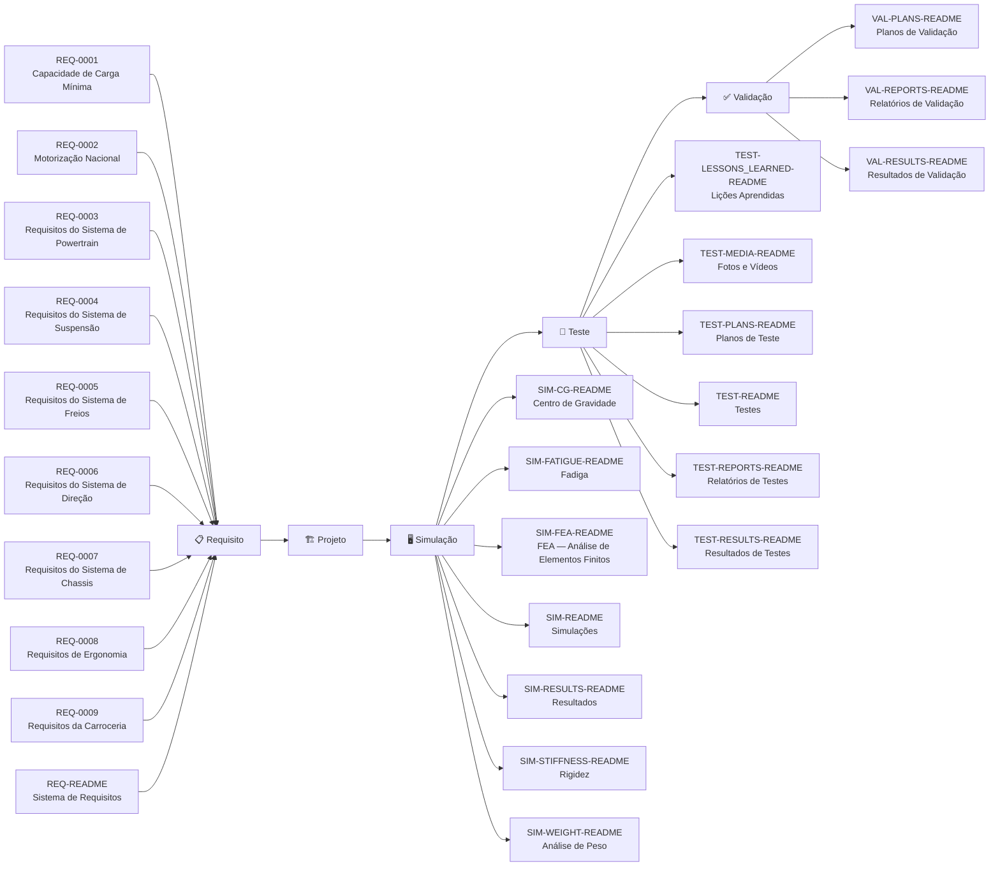

# Validation Flow

> ⚠️ **Arquivo gerado automaticamente.** Não edite manualmente.

```mermaid
flowchart LR
    REQ_STAGE["📋 Requisito"]
    DESIGN_STAGE["🏗️ Projeto"]
    SIM_STAGE["🖥️ Simulação"]
    TEST_STAGE["🧪 Teste"]
    VAL_STAGE["✅ Validação"]
    REQ_STAGE --> DESIGN_STAGE
    DESIGN_STAGE --> SIM_STAGE
    SIM_STAGE --> TEST_STAGE
    TEST_STAGE --> VAL_STAGE
    REQ_0001["REQ-0001<br/>Capacidade de Carga Mínima"] --> REQ_STAGE
    REQ_0002["REQ-0002<br/>Motorização Nacional"] --> REQ_STAGE
    REQ_0003["REQ-0003<br/>Requisitos do Sistema de Powertrain"] --> REQ_STAGE
    REQ_0004["REQ-0004<br/>Requisitos do Sistema de Suspensão"] --> REQ_STAGE
    REQ_0005["REQ-0005<br/>Requisitos do Sistema de Freios"] --> REQ_STAGE
    REQ_0006["REQ-0006<br/>Requisitos do Sistema de Direção"] --> REQ_STAGE
    REQ_0007["REQ-0007<br/>Requisitos do Sistema de Chassis"] --> REQ_STAGE
    REQ_0008["REQ-0008<br/>Requisitos de Ergonomia"] --> REQ_STAGE
    REQ_0009["REQ-0009<br/>Requisitos da Carroceria"] --> REQ_STAGE
    REQ_README["REQ-README<br/>Sistema de Requisitos"] --> REQ_STAGE
    SIM_STAGE --> SIM_CG_README["SIM-CG-README<br/>Centro de Gravidade"]
    SIM_STAGE --> SIM_FATIGUE_README["SIM-FATIGUE-README<br/>Fadiga"]
    SIM_STAGE --> SIM_FEA_README["SIM-FEA-README<br/>FEA — Análise de Elementos Finitos"]
    SIM_STAGE --> SIM_README["SIM-README<br/>Simulações"]
    SIM_STAGE --> SIM_RESULTS_README["SIM-RESULTS-README<br/>Resultados"]
    SIM_STAGE --> SIM_STIFFNESS_README["SIM-STIFFNESS-README<br/>Rigidez"]
    SIM_STAGE --> SIM_WEIGHT_README["SIM-WEIGHT-README<br/>Análise de Peso"]
    TEST_STAGE --> TEST_LESSONS_LEARNED_README["TEST-LESSONS_LEARNED-README<br/>Lições Aprendidas"]
    TEST_STAGE --> TEST_MEDIA_README["TEST-MEDIA-README<br/>Fotos e Vídeos"]
    TEST_STAGE --> TEST_PLANS_README["TEST-PLANS-README<br/>Planos de Teste"]
    TEST_STAGE --> TEST_README["TEST-README<br/>Testes"]
    TEST_STAGE --> TEST_REPORTS_README["TEST-REPORTS-README<br/>Relatórios de Testes"]
    TEST_STAGE --> TEST_RESULTS_README["TEST-RESULTS-README<br/>Resultados de Testes"]
    VAL_STAGE --> VAL_PLANS_README["VAL-PLANS-README<br/>Planos de Validação"]
    VAL_STAGE --> VAL_REPORTS_README["VAL-REPORTS-README<br/>Relatórios de Validação"]
    VAL_STAGE --> VAL_RESULTS_README["VAL-RESULTS-README<br/>Resultados de Validação"]
```
