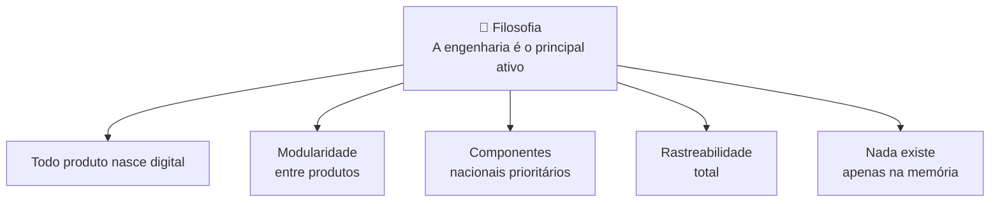

# Engenharia — Padrões e Processos

Documentação dos padrões, normas e processos de engenharia da empresa.

---

## Filosofia de Engenharia

---

## Documentação

| Área | Descrição | Link |
|------|-----------|------|
| Filosofia de Engenharia | Princípios e valores | [philosophy.md](./philosophy.md) |
| Padrões CAD | Convenções de modelagem CAD | [cad_standards/README.md](./cad_standards/README.md) |
| Nomenclatura | Sistema de nomenclatura e codificação | [nomenclature/README.md](./nomenclature/README.md) |
| Revisões | Processo de revisão documental | [revisions/README.md](./revisions/README.md) |
| BOM | Gestão da lista de materiais | [bom/README.md](./bom/README.md) |
| Gestão de Configuração | Controle de configuração do produto | [configuration/README.md](./configuration/README.md) |
| Templates | Templates de engenharia | [templates/README.md](./templates/README.md) |
| Biblioteca | Biblioteca técnica | [library/README.md](./library/README.md) |
| Controle Documental | Processo de controle documental | [document_control/README.md](./document_control/README.md) |

---

## Links Relacionados

- [Templates](../templates/README.md)
- [Produtos](../products/README.md)
- [Normas Aplicáveis](./library/README.md)
