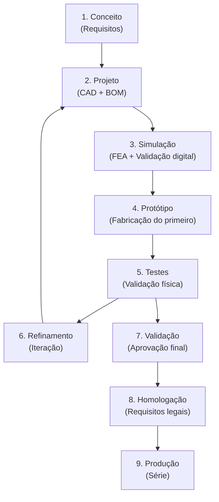

# Filosofia de Engenharia

## Princípios Fundamentais

### 1. A Engenharia é o Principal Ativo

O conhecimento de engenharia documentado vale mais que máquinas ou equipamentos. Invista em documentação desde o primeiro dia.

### 2. Todo Produto Nasce Digital

Nenhuma peça é fabricada sem que exista antes:
- Requisito documentado
- Projeto CAD
- BOM atualizada
- Simulação realizada (quando aplicável)
- Plano de teste

### 3. Modularidade

Projete cada componente pensando em reuso entre produtos:
- Defina interfaces padronizadas
- Use componentes da biblioteca sempre que possível
- Documente cada componente na biblioteca para reuso futuro

### 4. Componentes Nacionais

**Priorize sempre:**
1. Componentes disponíveis no mercado nacional
2. Fornecedores com histórico comprovado
3. Componentes com peças de reposição acessíveis
4. Componentes com suporte técnico local

### 5. Rastreabilidade Total

Toda decisão de engenharia deve ter:
- Contexto documentado
- Alternativas consideradas
- Justificativa da escolha
- Consequências previstas

Use o sistema de ADR para decisões relevantes.

### 6. Nada Existe Apenas na Memória

Se não está documentado, não existe. Registre:
- Cada decisão tomada
- Cada problema encontrado
- Cada lição aprendida
- Cada iteração de projeto

---

## Processo de Desenvolvimento

---

## Links Relacionados

- [Padrões CAD](./cad_standards/README.md)
- [Nomenclatura](./nomenclature/README.md)
- [Templates](../templates/README.md)
