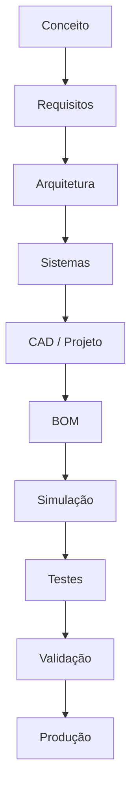

# Produtos

Este diretório concentra toda a documentação técnica de cada produto da empresa.

---

## Filosofia

---

## Produtos Ativos

| Produto | Status | Fase | Link |
|---------|--------|------|------|
| UTV Utilitário Modular | 🟡 Em desenvolvimento | Fundação | [utv/](./utv/README.md) |

---

## Produtos Futuros

| Produto | Status | Previsão |
|---------|--------|----------|
| Carreta Homologada | 🔵 Planejado | 2031 |
| Implementos Agrícolas | 🔵 Planejado | 2032 |
| Plataforma Modular Gen2 | 🔵 Planejado | 2033 |

---

## Links Relacionados

- [Roadmap de Produto](../roadmap/product/README.md)
- [Componentes Reutilizáveis](./utv/components/README.md)
- [Requisitos](../requirements/README.md)
- [Decisões](./utv/decisions/README.md)
