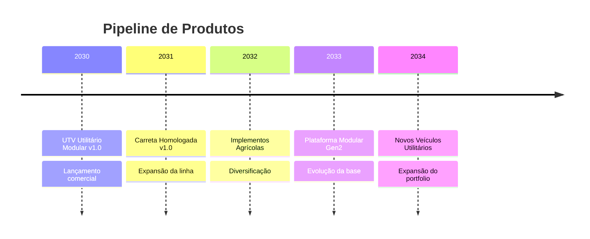

# Produtos Futuros

Produtos planejados para desenvolvimento após o UTV Utilitário Modular.

---

## Pipeline de Produtos

---

## Produtos Planejados

| Produto | Descrição | Dependência | Previsão |
|---------|-----------|-------------|----------|
| Carreta Homologada | Carreta compatível com bitola do UTV | UTV v1.0 | 2031 |
| Implementos Agrícolas | Linha de implementos modulares | Plataforma UTV | 2032 |
| Plataforma Modular Gen2 | Evolução da plataforma com melhorias | UTV v1.0 + feedback | 2033 |
| Novos Veículos Utilitários | Variantes e expansões da linha | Plataforma Gen2 | 2034+ |

---

## Filosofia de Expansão

A expansão de produtos será baseada em:

1. **Reuso de plataforma** — máximo compartilhamento de componentes
2. **Feedback de campo** — produto lançado informa o próximo
3. **Demanda de mercado** — validação antes de investimento
4. **Capacidade técnica** — crescimento gradual da equipe

---

## Links Relacionados

- [Roadmap de Produto](../../roadmap/product/README.md)
- [UTV — Produto atual](../utv/README.md)
- [Componentes Reutilizáveis](../../components/README.md)
