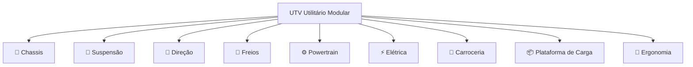
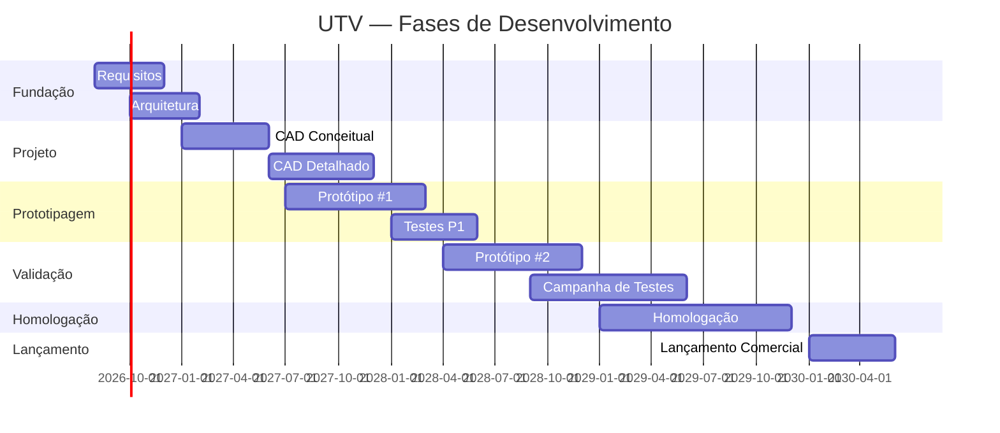

# UTV Utilitário Modular

## Visão Geral

O UTV Utilitário Modular é o primeiro produto da empresa.  
Projetado para aplicações agrícolas, rurais e de trabalho pesado no mercado brasileiro.

---

## Conceito

---

## Sistemas

| Sistema | Descrição | Status | Link |
|---------|-----------|--------|------|
| Chassis | Estrutura principal do veículo | 🟡 Em definição | [chassis/](./chassis/README.md) |
| Suspensão | Sistema de suspensão dianteiro e traseiro | 🟡 Em definição | [suspension/](./suspension/README.md) |
| Direção | Sistema de direção | 🟡 Em definição | [steering/](./steering/README.md) |
| Freios | Sistema de frenagem | 🟡 Em definição | [brakes/](./brakes/README.md) |
| Powertrain | Motor, transmissão e diferencial | 🟡 Em definição | [powertrain/](./powertrain/README.md) |
| Elétrica | Sistema elétrico e eletrônico | 🟡 Em definição | [electrical/](./electrical/README.md) |
| Carroceria | Painel, cabine e acabamentos | 🟡 Em definição | [body/](./body/README.md) |
| Plataforma de Carga | Plataforma modular traseira | 🟡 Em definição | [cargo_platform/](./cargo_platform/README.md) |
| Ergonomia | Posto de operação e conforto | 🟡 Em definição | [ergonomics/](./ergonomics/README.md) |

---

## Especificações Preliminares

| Parâmetro | Valor Alvo | Status |
|-----------|------------|--------|
| Capacidade de carga | ≥ 500 kg | A definir |
| Motorização | Motor diesel / gasolina nacional | A definir |
| Bitola | Compatível com implementos nacionais | A definir |
| Homologação | DENATRAN / INMETRO | A definir |
| Acionamento | 4x4 com tração traseira | A definir |

---

## Fases de Desenvolvimento

---

## Links Relacionados

- [Requisitos do UTV](../../requirements/README.md)
- [Arquitetura do Sistema](../../architecture/README.md)
- [BOM Principal](../../bom/README.md)
- [Plano de Testes](../../tests/README.md)
- [Simulações](../../simulations/README.md)
- [Decisões](../../decisions/README.md)
