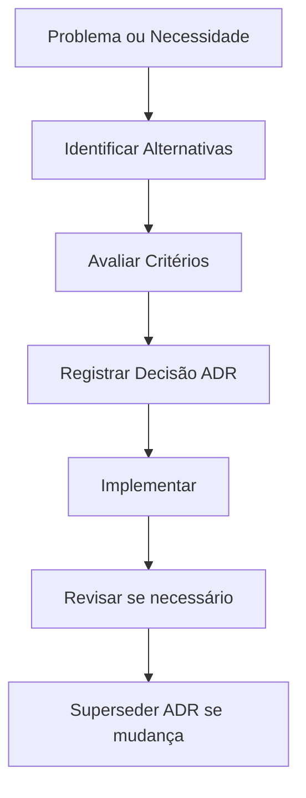

# Architecture Decision Records (ADR)

Todas as decisões técnicas e estratégicas relevantes são documentadas neste diretório.

---

## Por que ADR?

> "Toda decisão deve possuir histórico."

---

## Índice de ADRs

| ID | Título | Status | Data |
|----|--------|--------|------|
| [ADR-0001](./ADR-0001-repositorio-plm.md) | Repositório GitHub como PLM simplificado | ✅ Aceito | 2026-07-21 |
| [ADR-0002](./ADR-0002-chassis-tubular.md) | Chassis tubular como estrutura principal | 🟡 Proposto | 2026-07-21 |
| [ADR-0003](./ADR-0003-motor-nacional.md) | Motor de combustão nacional como propulsão inicial | 🟡 Proposto | 2026-07-21 |

---

## Status dos ADRs

| Status | Significado |
|--------|-------------|
| 🟡 Proposto | Em avaliação |
| ✅ Aceito | Decisão tomada e em vigor |
| ❌ Rejeitado | Alternativa avaliada e descartada |
| 🔄 Substituído | Substituído por novo ADR |
| ⚫ Obsoleto | Não mais relevante |

---

## Template de ADR

Use o [template de ADR](../../../templates/adr.md) para criar novos registros.

---

## Links Relacionados

- [Requisitos](../../../requirements/README.md)
- [Engenharia](../../../engineering/README.md)
- [Produtos](../../README.md)
