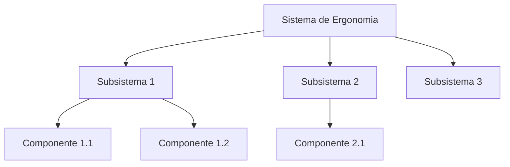

# Arquitetura — Sistema de Ergonomia

## Diagrama de Arquitetura

## Decomposição Funcional

| Subsistema | Função | Componentes Principais |
|------------|--------|------------------------|
| A definir | — | — |

## Interfaces

| Interface | Sistema Origem | Sistema Destino | Tipo |
|-----------|----------------|-----------------|------|
| A definir | — | — | — |

## Links Relacionados

- [Requisitos](./requirements.md)
- [BOM](./bom.md)
- [Simulações](./simulations.md)
