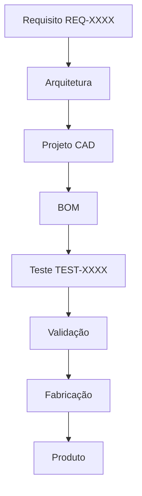

# Sistema de Requisitos

Todos os requisitos do produto são registrados e rastreados neste diretório.

---

## Estrutura de Rastreabilidade



---

## Índice de Requisitos

| ID | Título | Produto | Sistema | Status |
|----|--------|---------|---------|--------|
| [REQ-0001](./REQ-0001.md) | Capacidade de Carga Mínima | UTV | Chassis | 🟡 Em revisão |
| [REQ-0002](./REQ-0002.md) | Motorização Nacional | UTV | Powertrain | 🟡 Em revisão |
| [REQ-0003](./REQ-0003.md) | Homologação DENATRAN | UTV | Global | 🔴 Aberto |

---

## Formato do Identificador

```
REQ-XXXX
```

Exemplos: `REQ-0001`, `REQ-0042`, `REQ-1000`

---

## Status dos Requisitos

| Status | Significado |
|--------|-------------|
| 🔴 Aberto | Requisito identificado, não detalhado |
| 🟡 Em revisão | Em processo de detalhamento/revisão |
| 🟢 Aprovado | Revisado e aprovado |
| 🔵 Implementado | Solução de engenharia existente |
| ✅ Validado | Testado e validado |
| ⚫ Obsoleto | Cancelado ou substituído |

---

## Como Criar um Requisito

Use o [template de requisito](../templates/requirement.md).

---

## Links Relacionados

- [Produto UTV](../products/utv/README.md)
- [Testes](../tests/README.md)
- [Validação](../validation/README.md)
- [Decisões](../decisions/README.md)
