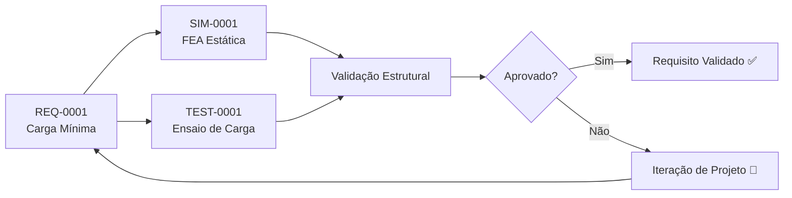

# REQ-0001 — Capacidade de Carga Mínima

## Descrição

O UTV deve ser capaz de transportar uma carga útil mínima de **500 kg** na plataforma traseira, sem comprometer a segurança estrutural, a dirigibilidade e a vida útil dos componentes.

---

## Rastreabilidade

| Campo | Valor |
|-------|-------|
| **Produto** | UTV Utilitário Modular |
| **Sistema** | Chassis, Suspensão, Plataforma de Carga |
| **Componente** | Longarinas, suporte de carga, molas de suspensão |
| **Norma** | ABNT NBR (a definir) |

---

## Critérios de Aceitação

| Critério | Valor | Unidade | Método de Verificação |
|----------|-------|---------|----------------------|
| Carga útil mínima | ≥ 500 | kg | Ensaio estático |
| Deflexão máxima do chassis | ≤ X | mm | FEA + ensaio |
| Fator de segurança estrutural | ≥ 2,0 | — | Simulação FEA |
| Capacidade de tração mínima | ≥ 100 | kgf | Ensaio dinâmico |

---

## Fluxo de Verificação

---

## Links Relacionados

- **Sistema afetado:** [Chassis](../products/utv/chassis/requirements.md)
- **Sistema afetado:** [Plataforma de Carga](../products/utv/cargo_platform/requirements.md)
- **Sistema afetado:** [Suspensão](../products/utv/suspension/requirements.md)
- **Simulação:** [/simulations/README.md](../simulations/README.md)
- **Teste:** [/tests/README.md](../tests/README.md)

---

## Histórico

| Rev | Data | Autor | Descrição |
|-----|------|-------|-----------|
| 1.0 | 2026-07-21 | Fundador | Criação inicial |
