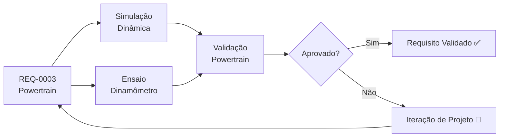

# REQ-0003 — Requisitos do Sistema de Powertrain

## Descrição

O sistema de powertrain do UTV deve prover propulsão suficiente para operação em terrenos rurais e off-road, utilizando componentes nacionais com cadeia de suprimentos consolidada no Brasil. O sistema abrange motor, transmissão, embreagem, diferencial e sistema de arrefecimento.

---

## Rastreabilidade

| Campo | Valor |
|-------|-------|
| **Produto** | UTV Utilitário Modular |
| **Sistema** | Powertrain |
| **Componentes** | Motor, transmissão, embreagem, diferencial, arrefecimento |
| **Norma** | PROCONVE / IBAMA, DENATRAN (a confirmar) |

---

## Critérios de Aceitação

| Critério | Valor | Unidade | Método de Verificação |
|----------|-------|---------|----------------------|
| Potência máxima | ≥ 60 | cv | Dados de catálogo / dinamômetro |
| Torque máximo | ≥ 120 | N·m | Dados de catálogo / dinamômetro |
| Velocidade máxima (pista) | ≥ 80 | km/h | Ensaio dinâmico |
| Capacidade de rampa | ≥ 30 | % | Ensaio em ramp |
| Motor disponível no mercado nacional | Sim | — | Pesquisa de fornecedores |
| Atende normas de emissão vigentes (PROCONVE) | Sim | — | Certificado do fabricante |
| Autonomia mínima com tanque cheio | ≥ 200 | km | Ensaio de consumo |
| Consumo máximo de combustível | ≤ 12 | L/100km | Ensaio de consumo |
| Transmissão com marcha à ré | Sim | — | Inspeção funcional |
| Relação de transmissão compatível com carga de 500 kg | Sim | — | Cálculo + ensaio |
| Temperatura de operação máxima do motor | ≤ 110 | °C | Instrumentação + ensaio |
| Tempo de aquecimento até temperatura nominal | ≤ 5 | min | Instrumentação |

---

## Fluxo de Verificação

---

## Links Relacionados

- **Requisito relacionado:** [REQ-0002 — Motorização Nacional](./REQ-0002.md)
- **Sistema afetado:** [Powertrain](../products/utv/powertrain/requirements.md)
- **Decisão:** [ADR-0003 — Motor Nacional](../decisions/ADR-0003-motor-nacional.md)
- **Simulação:** [/simulations/README.md](../simulations/README.md)
- **Teste:** [/tests/README.md](../tests/README.md)

---

## Histórico

| Rev | Data | Autor | Descrição |
|-----|------|-------|-----------|
| 1.0 | 2026-07-22 | Fundador | Criação inicial |
