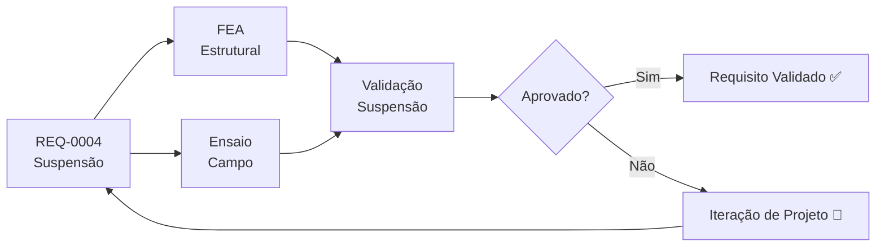

# REQ-0004 — Requisitos do Sistema de Suspensão

## Descrição

O sistema de suspensão do UTV deve garantir conforto ao operador, controle do veículo em terrenos irregulares e capacidade de suportar as cargas de operação, protegendo a estrutura e os componentes mecânicos contra impactos e vibrações de campo.

---

## Rastreabilidade

| Campo | Valor |
|-------|-------|
| **Produto** | UTV Utilitário Modular |
| **Sistema** | Suspensão |
| **Componentes** | Molas, amortecedores, braços, cubos de roda, pivôs |
| **Norma** | ABNT NBR (a definir) |

---

## Critérios de Aceitação

| Critério | Valor | Unidade | Método de Verificação |
|----------|-------|---------|----------------------|
| Curso de suspensão dianteira | ≥ 150 | mm | Medição física |
| Curso de suspensão traseira | ≥ 150 | mm | Medição física |
| Carga máxima suportada por eixo (traseiro) | ≥ 800 | kg | Ensaio estático |
| Carga máxima suportada por eixo (dianteiro) | ≥ 500 | kg | Ensaio estático |
| Frequência natural de ressonância (operador) | 0,5–2,5 | Hz | Análise modal |
| Frequência natural primária do sistema massa-mola | 1,5 ± 0,2 | Hz | Análise modal + ensaio de resposta ao impulso |
| Aceleração vertical máxima transmitida ao operador | ≤ 2,5 | m/s² RMS | Ensaio de vibração |
| Resistência dos componentes não suspensos sob aceleração equivalente | ≥ 20 | g | Simulação estrutural + ensaio dinâmico |
| Altura mínima do solo (vão livre) | ≥ 250 | mm | Medição física |
| Ângulo de ataque mínimo | ≥ 30 | ° | Medição geométrica |
| Ângulo de saída mínimo | ≥ 25 | ° | Medição geométrica |
| Capacidade de vencer obstáculo | ≥ 300 | mm | Ensaio off-road |
| Manutenção com ferramentas básicas | Sim | — | Inspeção e avaliação |
| Componentes disponíveis no mercado nacional | Sim | — | Pesquisa de fornecedores |

---

## Fluxo de Verificação

---

## Links Relacionados

- **Requisito relacionado:** [REQ-0001 — Capacidade de Carga Mínima](./REQ-0001.md)
- **Sistema afetado:** [Suspensão](../products/utv/suspension/requirements.md)
- **Decisão:** [ADR-0004 — Sistema de Suspensão](../decisions/ADR-0004-suspensao.md)
- **Simulação:** [/simulations/README.md](../simulations/README.md)
- **Teste:** [/tests/README.md](../tests/README.md)

---

## Histórico

| Rev | Data | Autor | Descrição |
|-----|------|-------|-----------|
| 1.1 | 2026-08-01 | Copilot | Adiciona requisitos de 20 g para componentes não suspensos e frequência massa-mola de 1,5 Hz |
| 1.0 | 2026-07-22 | Fundador | Criação inicial |
