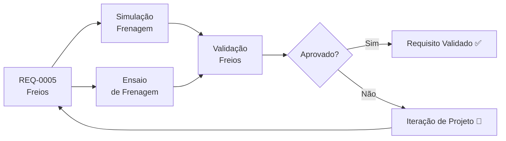

# REQ-0005 — Requisitos do Sistema de Freios

## Descrição

O sistema de freios do UTV deve garantir a capacidade de desaceleração segura em todas as condições de operação (pista e off-road), com ou sem carga, atendendo às exigências de segurança ativa definidas para o veículo.

---

## Rastreabilidade

| Campo | Valor |
|-------|-------|
| **Produto** | UTV Utilitário Modular |
| **Sistema** | Freios |
| **Componentes** | Discos/tambores, pinças, cilindro mestre, fluido de freio, freio de estacionamento |
| **Norma** | ABNT NBR 14840, DENATRAN (a confirmar) |

---

## Critérios de Aceitação

| Critério | Valor | Unidade | Método de Verificação |
|----------|-------|---------|----------------------|
| Distância de frenagem (80 km/h → 0, pista seca, sem carga) | ≤ 40 | m | Ensaio de frenagem |
| Distância de frenagem (60 km/h → 0, pista seca, com carga máx.) | ≤ 35 | m | Ensaio de frenagem |
| Desaceleração máxima | ≥ 6,5 | m/s² | Ensaio de frenagem |
| Freio atua nos 4 rodas | Sim | — | Inspeção funcional |
| Freio de estacionamento capaz de manter veículo em rampa | ≥ 20 | % rampa | Ensaio estático |
| Equilíbrio de frenagem entre eixos | Diferença ≤ 30 | % | Ensaio de frenagem |
| Temperatura máxima das pastilhas/lonas em uso contínuo | ≤ 350 | °C | Instrumentação + ensaio |
| Peças disponíveis no mercado nacional | Sim | — | Pesquisa de fornecedores |
| Troca de pastilhas/lonas sem ferramentas especiais | Sim | — | Inspeção e avaliação |
| Vida útil mínima das pastilhas/lonas | ≥ 20.000 | km | Ensaio de durabilidade |

---

## Fluxo de Verificação

---

## Links Relacionados

- **Sistema afetado:** [Freios](../products/utv/brakes/requirements.md)
- **Decisão:** [ADR-0005 — Sistema de Freios](../decisions/ADR-0005-freios.md)
- **Simulação:** [/simulations/README.md](../simulations/README.md)
- **Teste:** [/tests/README.md](../tests/README.md)

---

## Histórico

| Rev | Data | Autor | Descrição |
|-----|------|-------|-----------|
| 1.0 | 2026-07-22 | Fundador | Criação inicial |
