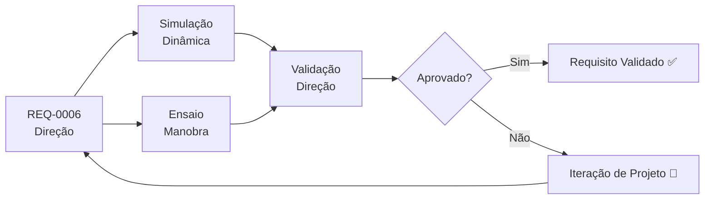

# REQ-0006 — Requisitos do Sistema de Direção

## Descrição

O sistema de direção do UTV deve permitir controle preciso e seguro do veículo em todas as condições de operação, incluindo terrenos irregulares, com e sem carga. O esforço de direção deve ser compatível com operação contínua sem fadiga excessiva do operador.

---

## Rastreabilidade

| Campo | Valor |
|-------|-------|
| **Produto** | UTV Utilitário Modular |
| **Sistema** | Direção |
| **Componentes** | Volante/manete, coluna de direção, caixa de direção, barra de direção, terminais, pivôs |
| **Norma** | ABNT NBR (a definir), DENATRAN (a confirmar) |

---

## Critérios de Aceitação

| Critério | Valor | Unidade | Método de Verificação |
|----------|-------|---------|----------------------|
| Raio de curvatura mínimo | ≤ 5,0 | m | Ensaio de manobra |
| Ângulo de esterçamento máximo por roda | ≥ 35 | ° | Medição geométrica |
| Esforço máximo no volante (operação normal) | ≤ 150 | N | Ensaio ergonômico |
| Esforço máximo no volante (manobra lenta, sem carga) | ≤ 80 | N | Ensaio ergonômico |
| Relação de desmultiplicação da direção | 14–18 | : 1 | Medição geométrica |
| Retorno natural ao centro após curva | Sim | — | Inspeção funcional |
| Ausência de vibração excessiva transmitida ao volante | Sim | — | Ensaio vibração |
| Ângulo de Caster compatível com estabilidade | 3–7 | ° | Medição geométrica |
| Componentes disponíveis no mercado nacional | Sim | — | Pesquisa de fornecedores |
| Ajuste de convergência sem ferramentas especiais | Sim | — | Inspeção e avaliação |

---

## Fluxo de Verificação

---

## Links Relacionados

- **Requisito relacionado:** [REQ-0004 — Suspensão](./REQ-0004.md)
- **Sistema afetado:** [Direção](../products/utv/steering/requirements.md)
- **Decisão:** [ADR-0006 — Sistema de Direção](../decisions/ADR-0006-direcao.md)
- **Simulação:** [/simulations/README.md](../simulations/README.md)
- **Teste:** [/tests/README.md](../tests/README.md)

---

## Histórico

| Rev | Data | Autor | Descrição |
|-----|------|-------|-----------|
| 1.0 | 2026-07-22 | Fundador | Criação inicial |
