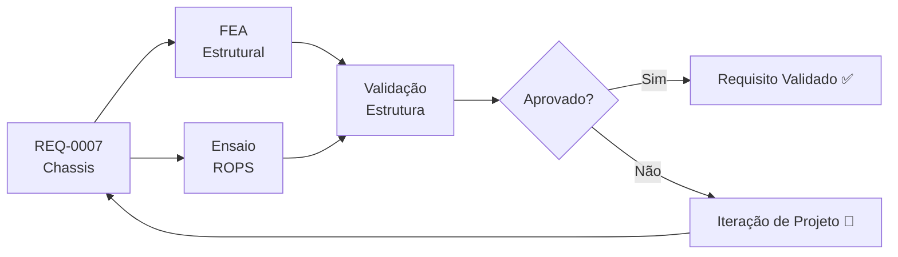

# REQ-0007 — Requisitos do Sistema de Chassis

## Descrição

O chassis do UTV é a estrutura principal que integra todos os sistemas do veículo. Deve garantir rigidez estrutural, resistência às cargas estáticas e dinâmicas de operação, proteção ao operador em caso de capotamento (ROPS), e facilidade de fabricação e manutenção com processos e materiais nacionais.

---

## Rastreabilidade

| Campo | Valor |
|-------|-------|
| **Produto** | UTV Utilitário Modular |
| **Sistema** | Chassis |
| **Componentes** | Longarinas, travessas, arco de proteção (ROPS), suportes de fixação |
| **Norma** | ABNT NBR (a definir), ISO 3471 (ROPS), DENATRAN |

---

## Requisitos principais da ISO 3471 (ROPS)

- A estrutura ROPS deve ser submetida a ensaios laboratoriais com aplicação sequencial de cargas **longitudinal**, **lateral** e **vertical**.
- A estrutura deve atender aos níveis de **força** e/ou **energia absorvida** exigidos para a classe/massa da máquina.
- Durante e após os ensaios, deve ser preservada a **DLV (Deflection-Limiting Volume)**, sem intrusão na zona de sobrevivência do operador.
- Não pode haver falha catastrófica da estrutura (ruptura/colapso) que comprometa a proteção ao operador.
- Os pontos de fixação do ROPS ao chassis devem manter integridade estrutural durante os ensaios.
- Referência oficial da norma: [ISO 3471 — Earth-moving machinery — Roll-over protective structures — Laboratory tests and performance requirements](https://www.iso.org/standard/35742.html)

---

## Critérios de Aceitação

| Critério | Valor | Unidade | Método de Verificação |
|----------|-------|---------|----------------------|
| Carga útil mínima suportada | ≥ 500 | kg | Ensaio estático (vide REQ-0001) |
| Massa total do chassis sem sistemas | ≤ 200 | kg | Pesagem |
| Fator de segurança estrutural | ≥ 2,0 | — | Simulação FEA |
| Deflexão máxima sob carga nominal | ≤ 10 | mm | FEA + ensaio |
| Frequência natural de vibração (torção) | ≥ 25 | Hz | Análise modal |
| Rigidez torcional mínima | ≥ 2.000 | N·m/° | Ensaio torcional |
| ROPS capaz de suportar esforços normativos | Sim | — | Ensaio conforme ISO 3471 |
| Comprimento total (com plataforma) | ≤ 3.500 | mm | Medição física |
| Largura máxima (entre rodas) | ≤ 1.800 | mm | Medição física |
| Material com disponibilidade nacional | Sim | — | Pesquisa de fornecedores |
| Pontos de fixação dos subsistemas claramente definidos | Sim | — | Inspeção do projeto |
| Fabricação possível por metalúrgica nacional | Sim | — | Análise de manufaturabilidade |

---

## Fluxo de Verificação

---

## Links Relacionados

- **Requisito relacionado:** [REQ-0001 — Capacidade de Carga Mínima](./REQ-0001.md)
- **Sistema afetado:** [Chassis](../products/utv/chassis/requirements.md)
- **Decisão:** [ADR-0002 — Chassis Tubular](../decisions/ADR-0002-chassis-tubular.md)
- **Simulação:** [/simulations/README.md](../simulations/README.md)
- **Teste:** [/tests/README.md](../tests/README.md)

---

## Histórico

| Rev | Data | Autor | Descrição |
|-----|------|-------|-----------|
| 1.1 | 2026-08-10 | Copilot | Detalhamento dos principais requisitos da ISO 3471 e inclusão do link oficial da norma |
| 1.0 | 2026-07-22 | Fundador | Criação inicial |
| 1.1 | 2026-08-10 | Fundador | Requisito aprovado após revisão |
