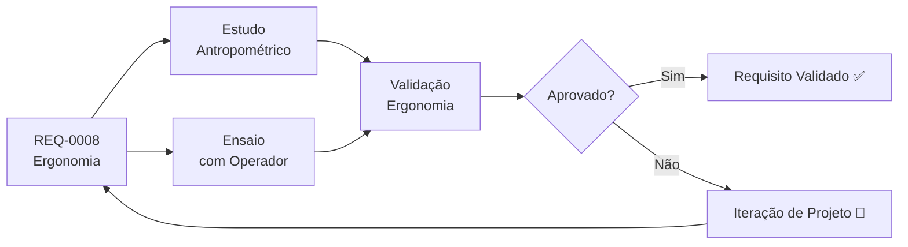

# REQ-0008 — Requisitos de Ergonomia

## Descrição

O UTV deve proporcionar ao operador condições adequadas de conforto, visibilidade e controle durante toda a jornada de trabalho, minimizando a fadiga e os riscos de acidentes relacionados à interface humano-máquina. O projeto deve atender ao perfil do operador rural brasileiro.

---

## Rastreabilidade

| Campo | Valor |
|-------|-------|
| **Produto** | UTV Utilitário Modular |
| **Sistema** | Ergonomia / Interface Operador-Máquina |
| **Componentes** | Assento, cinto de segurança, volante, pedais, painel de instrumentos, ROPS |
| **Norma** | ABNT NBR ISO 11684, NR-12 (a confirmar) |

---

## Critérios de Aceitação

| Critério | Valor | Unidade | Método de Verificação |
|----------|-------|---------|----------------------|
| Altura do banco ajustável | ± 50 | mm | Medição física |
| Distância ao volante ajustável | ± 80 | mm | Medição física |
| Espaço livre para pernas (P5 a P95 masculino brasileiro) | Adequado | — | Avaliação antropométrica |
| Ângulo de visibilidade frontal sem obstáculo | ≥ 120 | ° | Medição geométrica |
| Ângulo de visibilidade lateral | ≥ 160 | ° | Medição geométrica |
| Cintos de segurança para todos os ocupantes | Sim | — | Inspeção |
| Força máxima de operação nos pedais | ≤ 200 | N | Ensaio ergonômico |
| Legibilidade dos instrumentos sob sol direto | Sim | — | Avaliação em campo |
| Proteção contra chuva mínima (cabine ou toldo) | Sim | — | Inspeção / ensaio de molhamento |
| Ruído no posto do operador em uso normal | ≤ 85 | dB(A) | Ensaio de ruído |
| Vibração mano-braquial máxima nos controles | ≤ 5 | m/s² | Ensaio de vibração |
| Acesso e saída do operador em emergência | ≤ 5 | s | Ensaio de evacuação |

---

## Fluxo de Verificação

---

## Links Relacionados

- **Requisito relacionado:** [REQ-0007 — Chassis](./REQ-0007.md)
- **Requisito relacionado:** [REQ-0006 — Direção](./REQ-0006.md)
- **Sistema afetado:** [Ergonomia](../products/utv/ergonomics/requirements.md)
- **Decisão:** [ADR-0007 — Ergonomia e Interface do Operador](../decisions/ADR-0007-ergonomia.md)
- **Teste:** [/tests/README.md](../tests/README.md)

---

## Histórico

| Rev | Data | Autor | Descrição |
|-----|------|-------|-----------|
| 1.0 | 2026-07-22 | Fundador | Criação inicial |
