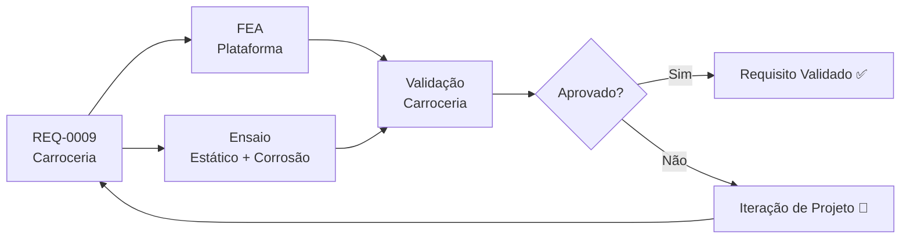

# REQ-0009 — Requisitos da Carroceria

## Descrição

A carroceria do UTV compreende todos os elementos de fechamento, proteção, plataforma de carga e cabine do operador. Deve proteger o operador e a carga contra intempéries, impactos e detritos de campo, além de definir a identidade visual do produto.

---

## Rastreabilidade

| Campo | Valor |
|-------|-------|
| **Produto** | UTV Utilitário Modular |
| **Sistema** | Carroceria |
| **Componentes** | Cabine/ROPS, painel dianteiro, para-lamas, plataforma de carga, portas/cortinas |
| **Norma** | ABNT NBR (a definir), DENATRAN |

---

## Critérios de Aceitação

| Critério | Valor | Unidade | Método de Verificação |
|----------|-------|---------|----------------------|
| Capacidade da plataforma de carga | ≥ 500 | kg | Ensaio estático (vide REQ-0001) |
| Volume útil da plataforma de carga | ≥ 1,0 | m³ | Medição física |
| Proteção mínima contra chuva para o operador | IP X4 | — | Ensaio de estanqueidade |
| Resistência a impacto de detritos na cabine | Sim | — | Ensaio de impacto |
| Acabamento resistente à corrosão (pintura + tratamento) | ≥ 500 | h salt spray | Ensaio ABNT NBR 8094 |
| Painéis desmontáveis para acesso à manutenção | Sim | — | Inspeção funcional |
| Massa total da carroceria sem carga | ≤ 150 | kg | Pesagem |
| Plataforma de basculamento para descarga (opcional) | Sim | — | Inspeção funcional |
| Fixação da carga por pontos de amarração | ≥ 4 | pontos | Inspeção |
| Material compatível com fabricação nacional (aço/fibra) | Sim | — | Análise de manufaturabilidade |
| Identificação visual (faixa/cor) conforme identidade da marca | Sim | — | Inspeção visual |

---

## Fluxo de Verificação

---

## Links Relacionados

- **Requisito relacionado:** [REQ-0001 — Capacidade de Carga Mínima](./REQ-0001.md)
- **Requisito relacionado:** [REQ-0007 — Chassis](./REQ-0007.md)
- **Requisito relacionado:** [REQ-0008 — Ergonomia](./REQ-0008.md)
- **Sistema afetado:** [Carroceria](../products/utv/body/requirements.md)
- **Decisão:** [ADR-0008 — Carroceria e Proteções](../decisions/ADR-0008-carroceria.md)
- **Simulação:** [/simulations/README.md](../simulations/README.md)
- **Teste:** [/tests/README.md](../tests/README.md)

---

## Histórico

| Rev | Data | Autor | Descrição |
|-----|------|-------|-----------|
| 1.0 | 2026-07-22 | Fundador | Criação inicial |
