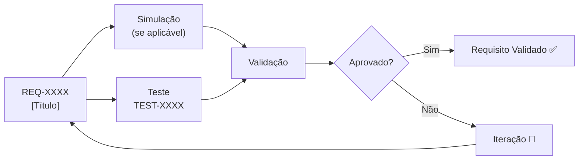

# REQ-XXXX — [TÍTULO DO REQUISITO]

## Descrição

[Descrição clara e objetiva do requisito. O que o sistema/produto DEVE fazer ou ser.]

---

## Rastreabilidade

| Campo | Valor |
|-------|-------|
| **Produto** | [Nome do produto] |
| **Sistema** | [Sistema ou subsistema] |
| **Componente** | [Componentes afetados] |
| **Norma** | [Norma ou regulamentação aplicável, se houver] |

---

## Critérios de Aceitação

| Critério | Valor | Unidade | Método de Verificação |
|----------|-------|---------|----------------------|
| [Critério 1] | [Valor] | [Unidade] | [Método] |
| [Critério 2] | [Valor] | [Unidade] | [Método] |

---

## Fluxo de Verificação

---

## Links Relacionados

- **Sistema afetado:** [Link para documentação do sistema]
- **Teste relacionado:** [Link para plano de teste]
- **Simulação:** [Link para simulação]
- **ADR relacionado:** [Link para ADR, se aplicável]

---

## Histórico

| Rev | Data | Autor | Descrição |
|-----|------|-------|-----------|
| 1.0 | YYYY-MM-DD | [Autor] | Criação inicial |
