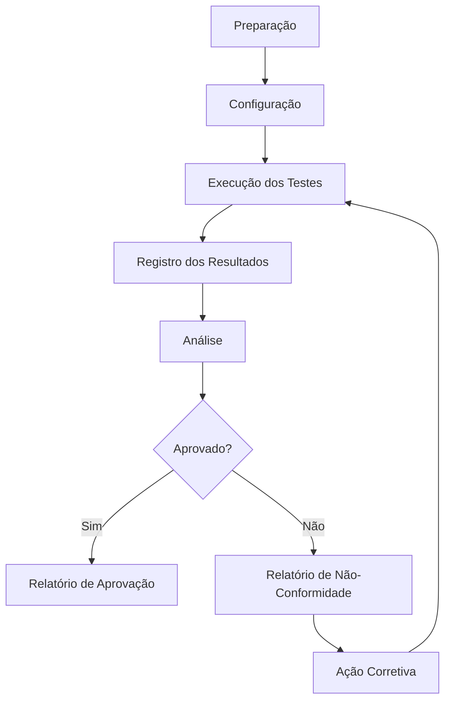

# Plano de Testes — [SISTEMA/PRODUTO]

## Objetivo

[Descreva o objetivo dos testes e o que será verificado.]

## Escopo

| Campo | Valor |
|-------|-------|
| **Produto/Sistema** | [Nome] |
| **Fase** | [Fase do protótipo] |
| **Requisitos cobertos** | REQ-XXXX, REQ-XXXX |

## Casos de Teste

| ID | Descrição | Requisito | Método | Critério de Aceite | Status |
|----|-----------|-----------|--------|-------------------|--------|
| TC-001 | [Descrição] | REQ-XXXX | [Método] | [Critério] | 🔴 Pendente |
| TC-002 | [Descrição] | REQ-XXXX | [Método] | [Critério] | 🔴 Pendente |

## Recursos Necessários

| Recurso | Descrição | Disponível |
|---------|-----------|------------|
| [Equipamento] | [Descrição] | ✅ / ❌ |

## Procedimento Geral

## Resultados

| ID | Data | Resultado | Aprovado | Observações |
|----|------|-----------|----------|-------------|
| TC-001 | — | — | — | — |

## Lições Aprendidas

[A ser preenchido após execução dos testes]

## Links Relacionados

- [Requisitos testados]
- [Plano de validação]
- [Relatório de resultados]
